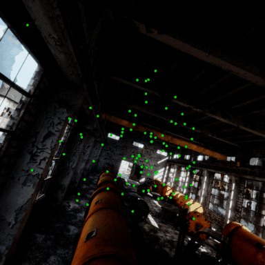
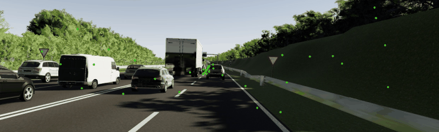
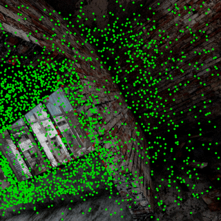
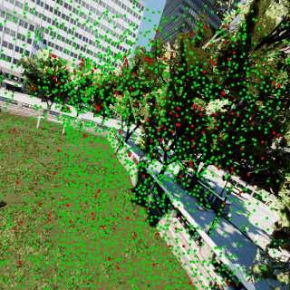
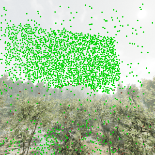
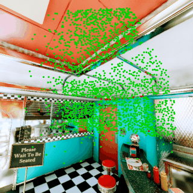
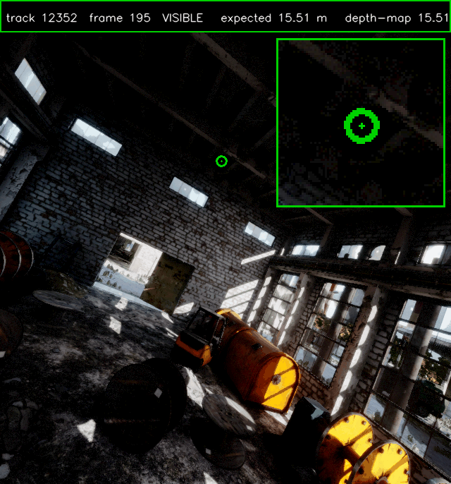
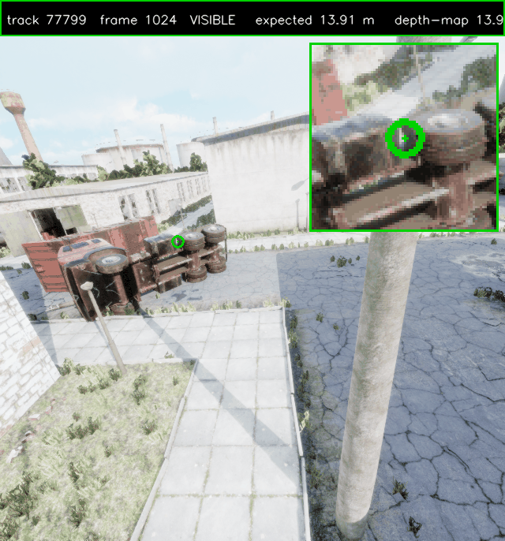

# TAv2 track chunking + visibility regeneration — inspection artifacts (2026-06-11)

Branch: `ericwang/tav2-track-chunking` (stacked on samli/po-chunking-optimization, PR #117962).
Nothing uploaded to Azure yet — all artifacts below come from local SKIP_UPLOAD sample runs.

## gifs/ — animated overlays (start here)

80 consecutive frames each, 10 fps. Green = visible track, red = valid-but-occluded.

**Chunk alignment** (tracks read back from the offline chunk tree, RGB fetched at
`frame_start + relative` — dots must stick to scene features):

**Regenerated visibility** (depth-reprojection occlusion; red dots flip on when the
tracked point goes behind geometry):

## gifs/ single-track occlusion verification

One track followed through its visible -> occluded transition; the text bar shows the
actual decision quantities per frame (expected z-depth of the anchored world point vs the
depth map sampled at the track position; occluded iff gap > 0.1 m and > 0.5 %). Zoom inset
top-right. Marker green = visible, red = occluded.

## chunk_overlays/ (stills)
Single-frame versions of the chunk-alignment check across the whole temporal window
(rel 0 .. end), TAv2 AbandonedCable/Data_easy/P001 t001 (frame_start=296) and VK2
Scene20/clone Camera_0 t001 (frame_start=279).

## visibility/ (stills)
Time-lapse stills across each full trajectory.

| sequence | visible (old -> new) | flipped | drift px (median / p90) | anchor fallback |
|---|---|---|---|---|
| AbandonedCable P001 (industrial) | 1.000 -> 0.938 | 6.2 % | 0.34 / 2.1 | 26 % |
| ForestEnv P000 (vegetation)      | 1.000 -> 0.936 | 6.4 % | 0.19 / 5.6 | 50 % |
| AmericanDiner P000 (indoor)      | 1.000 -> 0.967 | 3.3 % | 0.27 / 0.7 | 0.4 % |
| Downtown P000 (urban)            | 1.000 -> 0.924 | 7.6 % | 0.21 / 3.3 | 20 % |

"Anchor fallback" tracks (no reliable depth anchor: sky / depth edges) keep their old
degenerate visibility. Drift = reprojection error of the static world point vs the stored
2D track — sub-pixel medians validate the static-scene assumption.
